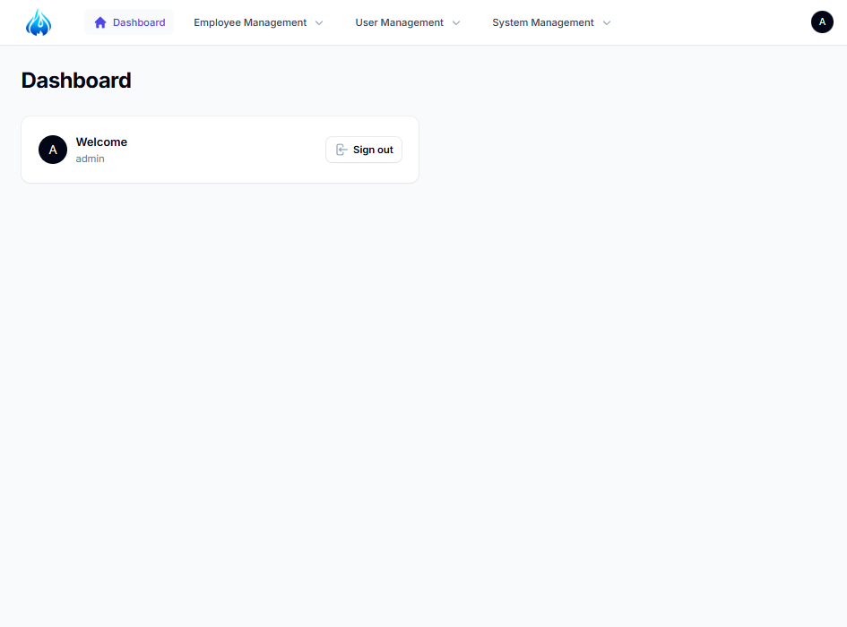
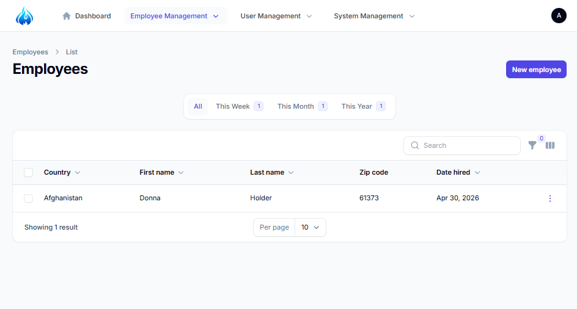
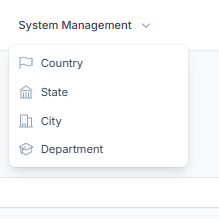
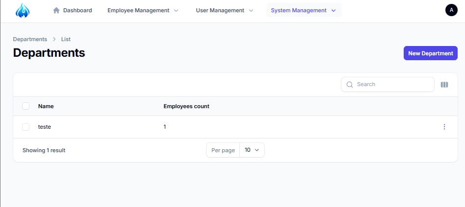
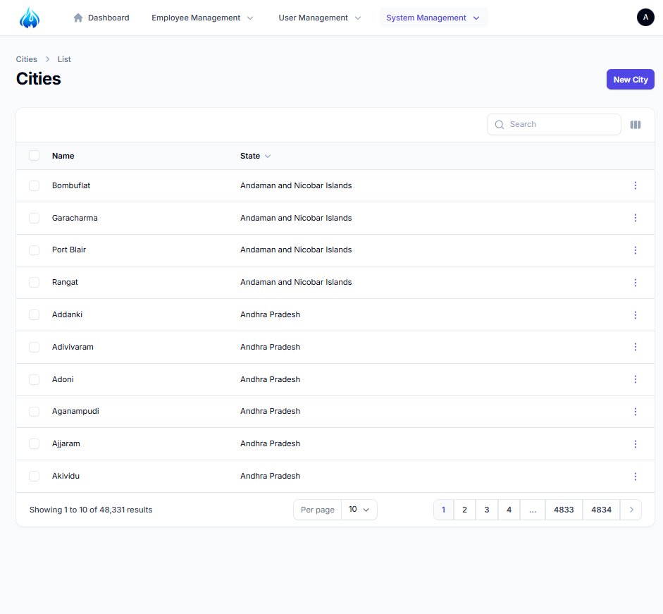

# ⚙️ Painel Administrativo com Laravel + Filament

Projeto de painel administrativo desenvolvido com **Laravel** e **Filament**, com foco em gerenciamento de dados organizacionais como funcionários, departamentos e localização (país, estado e cidade).

---

## 🚀 Tecnologias utilizadas

* PHP (Laravel)
* Filament (Admin Panel)
* MySQL
* Tailwind CSS
* Eloquent ORM

---

## 📦 Funcionalidades

* Dashboard administrativo
* CRUD de Funcionários (Employees)
* CRUD de Departamentos
* CRUD de Países, Estados e Cidades
* Relacionamentos entre entidades (ex: funcionário → departamento → localização)
* Filtros e busca nas tabelas
* Organização por menus no painel
* Estrutura preparada para múltiplos painéis

---

## 🧠 Objetivo do projeto

Este projeto foi desenvolvido com o objetivo de **praticar a construção de painéis administrativos reais** utilizando Laravel e Filament, explorando:

* criação de recursos (Resources)
* relacionamento entre tabelas
* organização de menus
* estrutura de sistemas administrativos

---

## ⚠️ Observações

* O projeto foi desenvolvido com base em uma série de estudos e vídeos, com adaptações e testes próprios durante o aprendizado.
* Existe um segundo painel no sistema criado apenas para **testes de múltiplos painéis no Filament**.
* O foco principal do projeto é o painel administrativo de gerenciamento.

---

## ▶️ Como rodar o projeto

### 1. Clonar o repositório

```bash
git clone https://github.com/seu-usuario/seu-repositorio.git
```

### 2. Acessar a pasta

```bash
cd Filament-Painel
```

### 3. Instalar dependências

```bash
composer install
```

### 4. Criar o .env

```bash
copy .env.example .env
```

### 5. Gerar chave

```bash
php artisan key:generate
```

### 6. Configurar banco de dados

No `.env`:

```env
DB_DATABASE=filament_painel
DB_USERNAME=root
DB_PASSWORD=
```

### 7. Rodar migrations

```bash
php artisan migrate
```

### 8. Seeders

```bash
php artisan db:seed
```

### 9. Rodar o projeto

```bash
php artisan serve
```

---

## 👤 Acesso ao painel

```text
http://127.0.0.1:8000/admin
```

Criar usuário:

```bash
php artisan make:filament-user
```

---

## 📷 Screenshots

### Dashboard



### Gerenciamento de Funcionários



### Menu de Gerenciamento do Sistema



### Gerenciamento de Departamentos



### Gerenciamento de Cidades



---

## 📚 Fonte de estudo

Baseado em uma série de vídeos sobre Laravel + Filament:

https://www.youtube.com/playlist?list=PL6tf8fRbavl3jfL67gVOE9rF0jG5bNTMi

---

## 📌 Status do projeto

🚧 Projeto de estudo (não finalizado)

---

## 💡 Autor

Desenvolvido por Isak Gabriel
